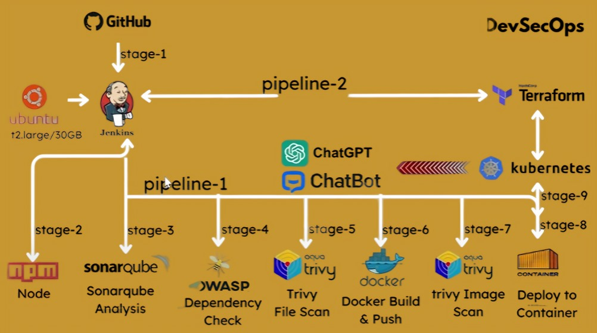

# 🤖 OpenAI Chatbot UI Deployment in EKS using Jenkins and Terraform



This project demonstrates a complete **DevSecOps pipeline** to deploy a **ChatGPT-powered Chatbot UI** on **Amazon EKS** using **Jenkins** for CI/CD and **Terraform** for infrastructure provisioning. The pipeline includes code quality checks, vulnerability scanning, Docker image handling, and secure container deployment.

---

## 🔧 Tech Stack

- **GitHub** – Source code management  
- **Ubuntu EC2 (t2.large / 30GB)** – Jenkins host  
- **Jenkins** – CI/CD Orchestration  
- **Node.js & npm** – Application build  
- **SonarQube** – Code quality analysis  
- **OWASP Dependency Check** – Vulnerability scanning  
- **Trivy** – File and Docker image scanning  
- **Docker** – Containerization  
- **Kubernetes (EKS)** – Deployment  
- **Terraform** – Infrastructure provisioning  

---

## 📊 Pipeline Stages

| Stage     | Description                      | Tool Used                 |
|-----------|----------------------------------|---------------------------|
| Stage 1   | Clone from GitHub                | GitHub                    |
| Stage 2   | Install Dependencies             | npm                       |
| Stage 3   | Code Quality Analysis            | SonarQube                 |
| Stage 4   | Dependency Vulnerability Scan    | OWASP Dependency Check    |
| Stage 5   | Trivy File Scan                  | Trivy                     |
| Stage 6   | Docker Build and Push            | Docker                    |
| Stage 7   | Trivy Image Scan                 | Trivy                     |
| Stage 8   | Deploy to Kubernetes             | kubectl                   |
| Stage 9   | Provision Infra (EKS)            | Terraform                 |

---


## ⚙️ Jenkinsfile

```groovy
pipeline{
    agent any
    tools{
        jdk 'jdk17'
        nodejs 'node19'
    }
    environment {
        SCANNER_HOME=tool 'sonar-scanner'
    }
    stages {
        stage('Checkout from Git'){
            steps{
                git branch: 'legacy', url: 'https://github.com/vijaygiduthuri/chatbot-ui.git'
            }
        }
        stage('Install Dependencies') {
            steps {
                sh "npm install"
            }
        }
        stage("Sonarqube Analysis "){
            steps{
                withSonarQubeEnv('sonar-server') {
                    sh ''' $SCANNER_HOME/bin/sonar-scanner -Dsonar.projectName=chatbot \
                    -Dsonar.projectKey=chatbot '''
                }
            }
        }
        stage("quality gate"){
           steps {
                script {
                    waitForQualityGate abortPipeline: false, credentialsId: 'Sonar-token'
                }
            }
        }
        stage('OWASP FS SCAN') {
            steps {
                dependencyCheck additionalArguments: '--scan ./ --disableYarnAudit --disableNodeAudit', odcInstallation: 'DP-Check'
                dependencyCheckPublisher pattern: '**/dependency-check-report.xml'
            }
        }
        stage('TRIVY FS SCAN') {
            steps {
                sh "trivy fs . > trivyfs.json"
            }
        }
        stage("Docker Build & Push"){
            steps{
                script{
                   withDockerRegistry(credentialsId: 'docker', toolName: 'docker'){
                       sh "docker build -t chatbot ."
                       sh "docker tag chatbot vijaygiduthuri/chatbot:latest "
                       sh "docker push vijaygiduthuri/chatbot:latest "
                    }
                }
            }
        }
        stage("TRIVY"){
            steps{
                sh "trivy image vijaygiduthuri/chatbot:latest > trivy.json"
            }
        }
        stage('Deploy to container'){
            steps{
                sh 'docker run -d --name chat -p 3000:3000 vijaygiduthuri/chatbot:latest'
            }
        }
        stage('Deploy to kubernets'){
            steps{
                script{
                    withKubeConfig(caCertificate: '', clusterName: '', contextName: '', credentialsId: 'k8s', namespace: '', restrictKubeConfigAccess: false, serverUrl: '') {
                       sh 'kubectl apply -f k8s/chatbot-ui.yaml'
                  }
                }
            }
        }
    }
}

````
## 🐳 Dockerfile
```
# ---- Base Node ----
FROM node:19-alpine AS base
WORKDIR /app
COPY package*.json ./

# ---- Dependencies ----
FROM base AS dependencies
RUN npm ci

# ---- Build ----
FROM dependencies AS build
COPY . .
RUN npm run build

# ---- Production ----
FROM node:19-alpine AS production
WORKDIR /app
COPY --from=dependencies /app/node_modules ./node_modules
COPY --from=build /app/.next ./.next
COPY --from=build /app/public ./public
COPY --from=build /app/package*.json ./
COPY --from=build /app/next.config.js ./next.config.js
COPY --from=build /app/next-i18next.config.js ./next-i18next.config.js

# Expose the port the app will run on
EXPOSE 3000

# Start the application
CMD ["npm", "start"]
```
## ⚙️ SonarQube Configuration
sonar.projectKey=ChatbotUI
sonar.projectName=Chatbot UI
sonar.projectVersion=1.0
sonar.sources=.
sonar.sourceEncoding=UTF-8

## 🔐 OWASP Dependency Check
#!/bin/bash
mkdir -p owasp
dependency-check.sh --project "Chatbot UI" --scan . --out owasp/

## 🔍 Trivy File Scan
trivy-scan.sh
#!/bin/bash
trivy fs --exit-code 0 --severity HIGH,CRITICAL $1

## ☁️ Terraform Infrastructure Code
terraform/main.tf
provider "aws" {
  region = "us-west-2"
}

resource "aws_eks_cluster" "chatbot_eks" {
  name     = "chatbot-cluster"
  role_arn = aws_iam_role.eks_cluster.arn
  # ... additional configs
}

## 📦 Kubernetes Deployment Files
deployment/namespace.yaml

apiVersion: apps/v1
kind: Deployment
metadata:
  name: chatbot-ui
  namespace: chatbot
spec:
  replicas: 2
  selector:
    matchLabels:
      app: chatbot-ui
  template:
    metadata:
      labels:
        app: chatbot-ui
    spec:
      containers:
      - name: chatbot-ui
        image: your-dockerhub-username/chatbot-ui
        ports:
        - containerPort: 3000

## ✅ Prerequisites
AWS CLI configured (aws configure)

Docker installed and DockerHub access

Jenkins with required plugins (Git, Pipeline, Docker, SonarQube Scanner)

Trivy and OWASP CLI tools installed

kubectl configured for EKS

Terraform >= 1.3

